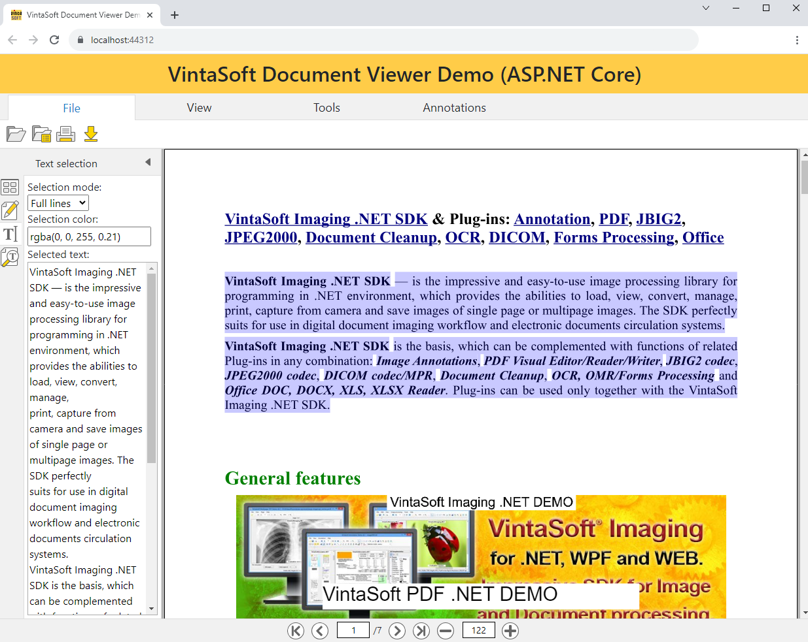
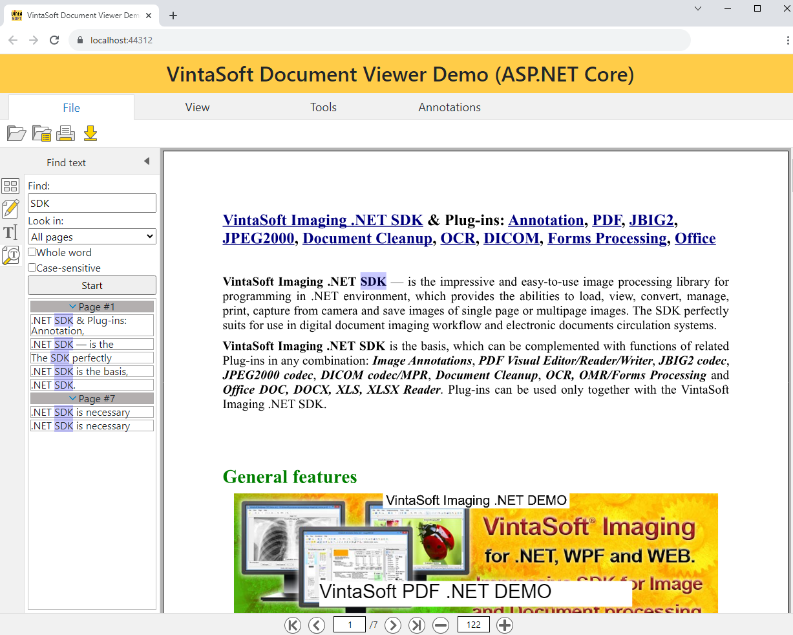
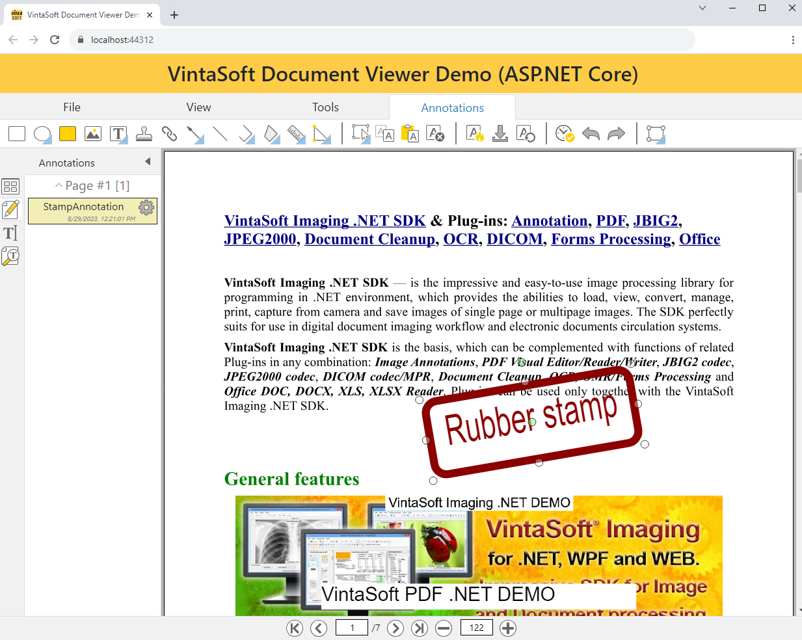

# VintaSoft ASP.NET Core Document Viewer Demo

This ASP.NET Core project uses <a href="https://www.vintasoft.com/vsimaging-dotnet-index.html">VintaSoft Imaging .NET SDK</a>.
The client-side of project uses HTML+JavaScript+CSS. The server-side of project uses ASP.NET Core API controllers.<br />
<br />
The project demonstrates how to view and annotate documents in ASP.NET Core:
* Open document.
* View pages with annotations.
* Select text on pages.
* Search text on pages.
* Annotate pages:
  * Annotate pages using 25 annotation types: rectangle, ellipse, highlight, image, text, sticky note, free text, stamp, line, polyline, polygon, freehand, freehand polygon, ruler, angle, mark, etc.
  * Burn annotations on image.
  * Rotate image with annotations.
  * Undo/redo actions with annotations.
* Print document with annotations.
* Download annotated document.
* The application can be used in any modern HTML5 web browser.
* The application UI is localized into 30 languages (Afrikaans, Arabic, Belarusian, Bulgarian, Chinese, Croatian, Czech, Danish, Dutch, German, Greece, English, Finnish, French, Hebrew, Hindi, Hungarian, Italian, Japanese, Korean, Norwegian, Portugese, Romanian, Russian, Slovakian, Slovenian, Spanish, Swedish, Turkish, Vietnamese).


## Screenshot
<br />




## Usage
1. Get the 30 day free evaluation license for <a href="https://www.vintasoft.com/vsimaging-dotnet-index.html" target="_blank">VintaSoft Imaging .NET SDK</a> as described here: <a href="https://www.vintasoft.com/docs/vsimaging-dotnet/Licensing-Evaluation.html" target="_blank">https://www.vintasoft.com/docs/vsimaging-dotnet/Licensing-Evaluation.html</a>

2. Update the evaluation license in "src\Startup.cs" file:
   ```
   Vintasoft.Imaging.ImagingGlobalSettings.Register("REG_USER", "REG_EMAIL", "EXPIRATION_DATE", "REG_CODE");
   ```

3. Build the project ("AspNetCoreDocumentViewerDemo.Net7.csproj" file) in Visual Studio or using .NET CLI:
   ```
   dotnet build AspNetCoreDocumentViewerDemo.Net7.csproj
   ```

4. Run compiled application and try to view and annotate images and documents.


## Documentation
VintaSoft Imaging .NET SDK on-line User Guide and API Reference for Web developer is available here: https://www.vintasoft.com/docs/vsimaging-dotnet-web/


## Support
Please visit our <a href="https://myaccount.vintasoft.com/">online support center</a> if you have any question or problem.
